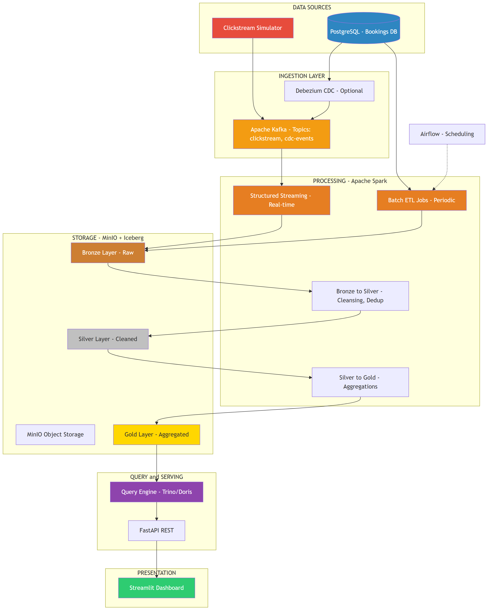
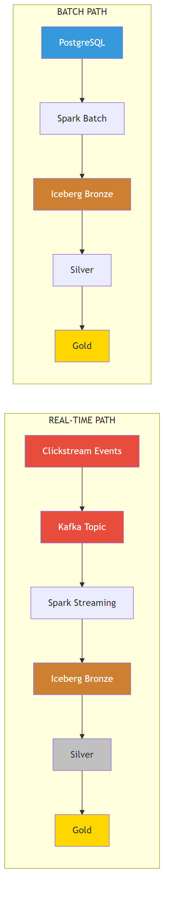
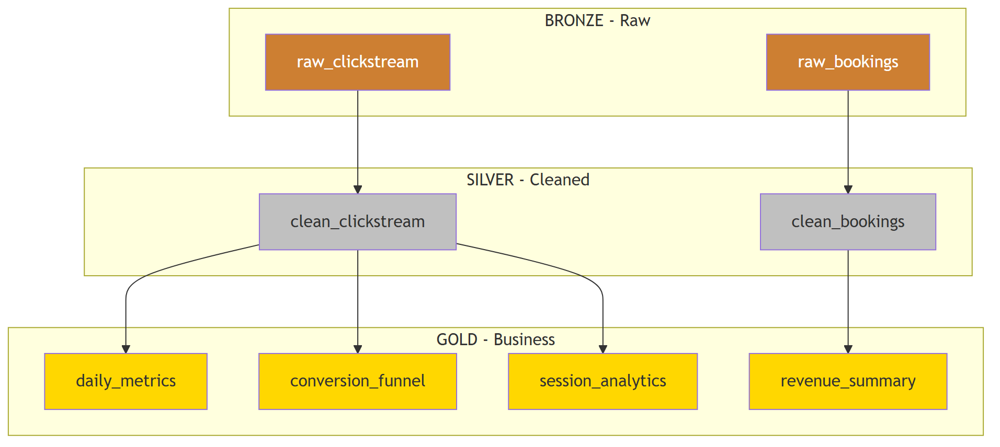

# System Architecture - Final Project: LakeHouse

> YEU CAU: Hoc vien can tu ve System Architecture diagram tuong tu (hoac tot hon) bang draw.io, Lucidchart, hoac Excalidraw. Diagram duoi day la **mau tham khao**.

## Tong quan kien truc LakeHouse

---

## Real-time vs Batch Data Flow

---

## Medallion Architecture Detail

---

## Yeu cau cho Architecture Diagram (BAT BUOC)

### Phai co:
1. **Tat ca components** voi technology labels
2. Phan biet ro **Real-time path** vs **Batch path**
3. **Medallion Architecture** (Bronze -> Silver -> Gold)
4. **Data flow arrows** voi labels mo ta
5. **Ports** va connection details
6. Export thanh **PNG** chat luong cao

### Tieu chi cham diem Architecture:

| Tieu chi | Diem |
|----------|-------|
| Day du components | 3d |
| Data flow ro rang | 3d |
| Real-time vs Batch path | 2d |
| Chuyen nghiep, de doc | 2d |
| **Tong** | **10d** |

### Cong cu goi y:
- **draw.io** (mien phi): https://app.diagrams.net
- **Excalidraw** (sketch style): https://excalidraw.com
- **Lucidchart**: Chuyen nghiep, co AWS/GCP icons
