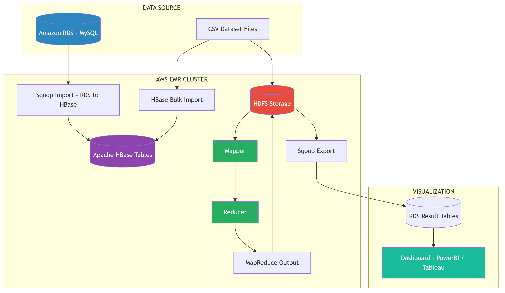

# System Architecture - Mini Project 1: Hadoop + HBase + Sqoop

## System Architecture Diagram

---

## Huong dan ve Architecture

### Yeu cau bat buoc:
1. The hien luong du lieu: RDS -> Sqoop -> HBase -> MapReduce -> Sqoop -> RDS -> Dashboard
2. Ghi ro technology o moi component
3. The hien HDFS storage
4. The hien MapReduce flow (Mapper -> Shuffle -> Reducer)
