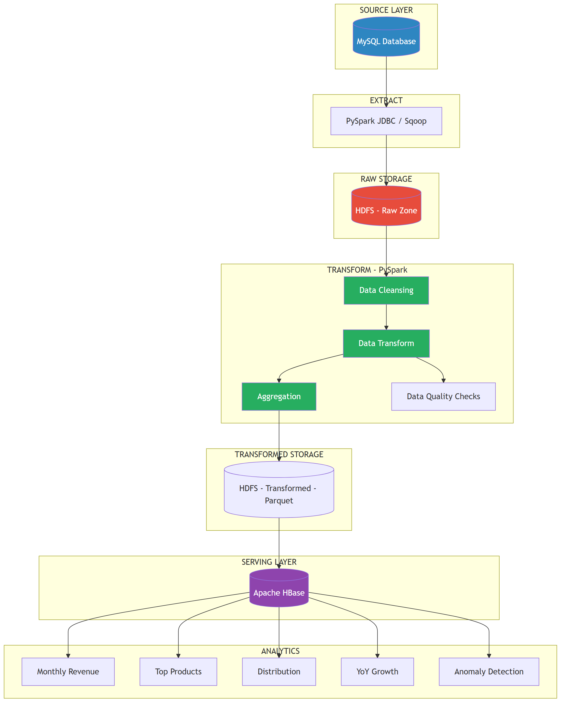

# System Architecture - Mini Project 2: Big Data ETL Pipeline

## Pipeline Architecture

---

## Huong dan ve Architecture

### Yeu cau bat buoc:
1. The hien luong du lieu: MySQL -> PySpark Extract -> HDFS -> Transform -> HBase -> Analytics
2. Ghi ro technology va data format o moi layer
3. The hien Data Quality Checks
4. The hien HBase table design (Column Families)
