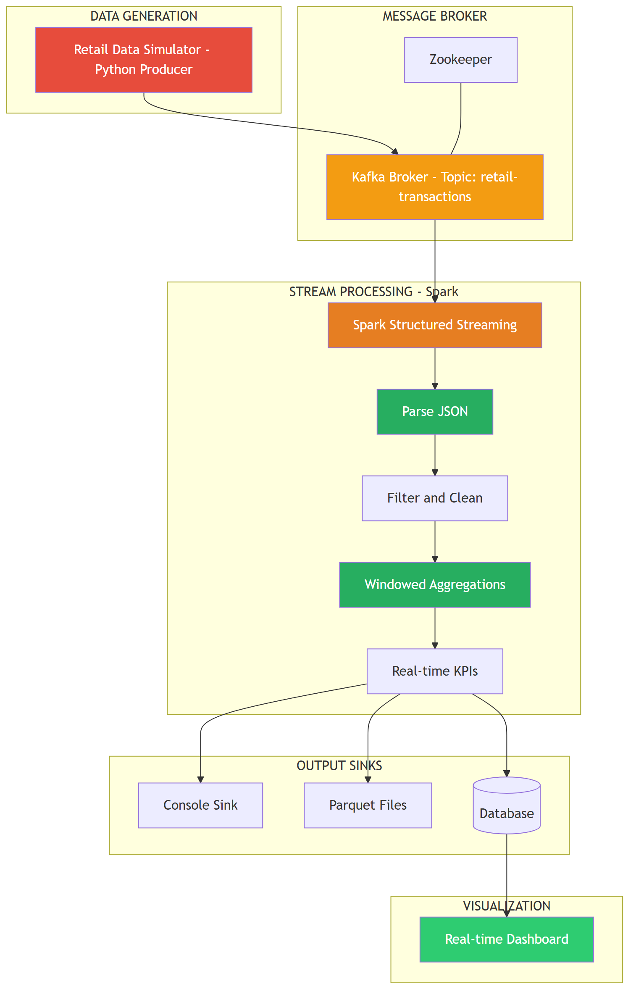

# System Architecture - Mini Project 3: Real-time Retail Analysis

## System Architecture Diagram

---

## Huong dan ve Architecture

### Yeu cau bat buoc:
1. The hien **Kafka** voi topics va partitions
2. The hien **Spark Streaming** processing pipeline
3. Mo ta **windowing strategy** (tumbling vs sliding)
4. The hien **output sinks** (console, files, DB)
5. Data flow direction ro rang

### Goi y them:
- Ghi chu **throughput** va **latency** mong doi
- The hien **fault tolerance** (checkpointing)
- Ghi chu **consumer groups** va **offset management**
