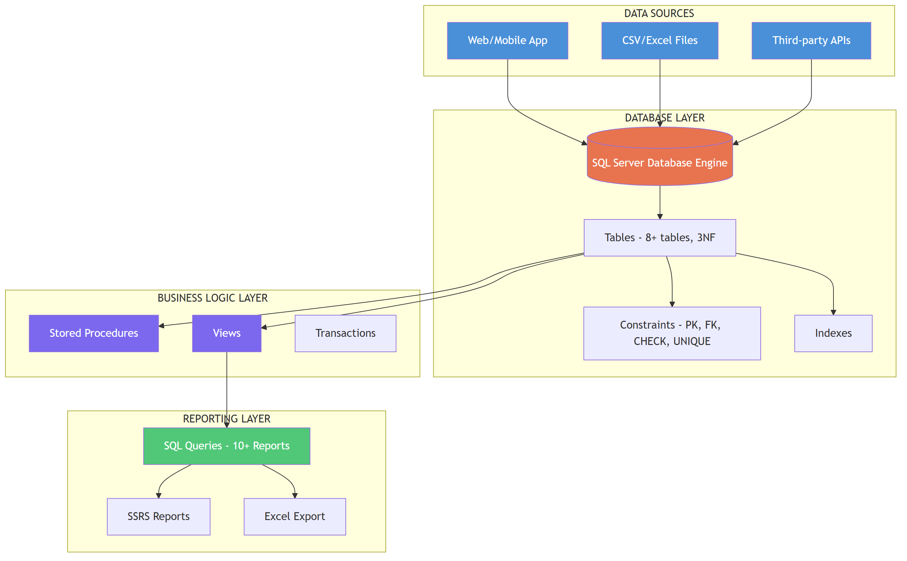
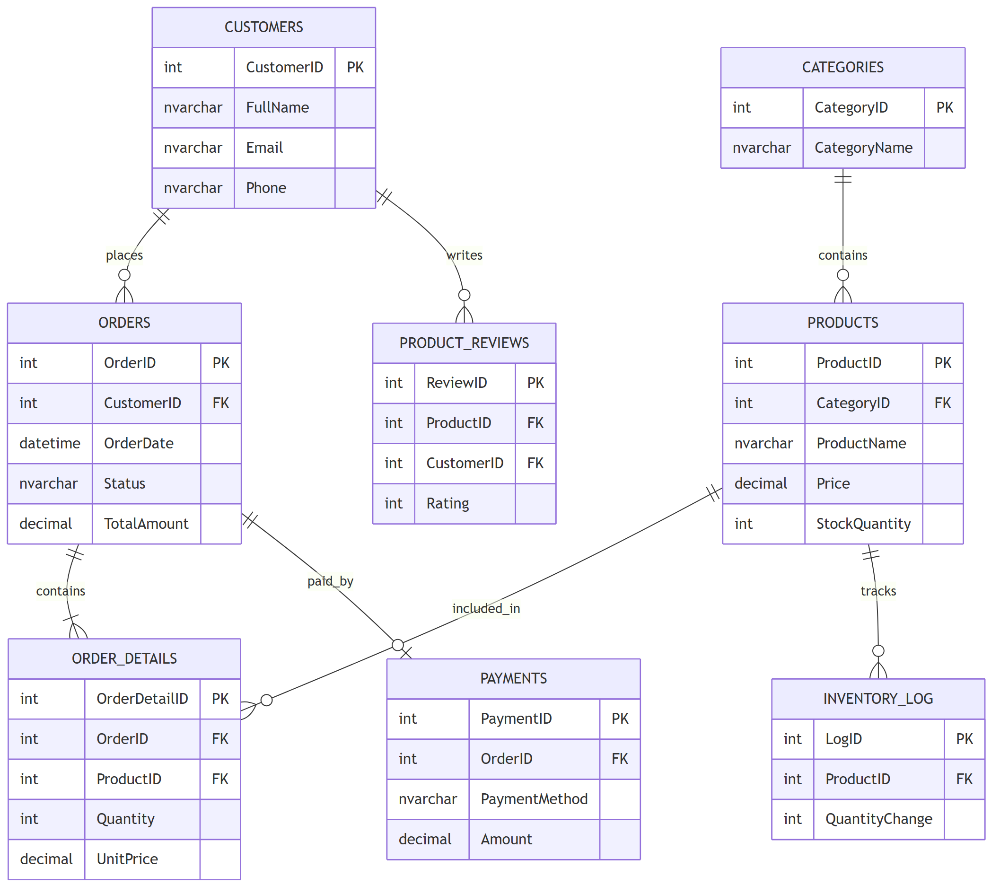
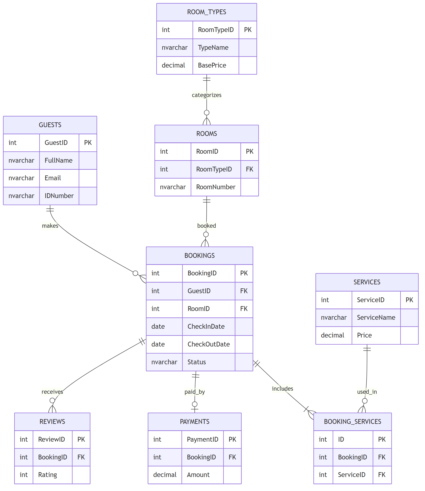
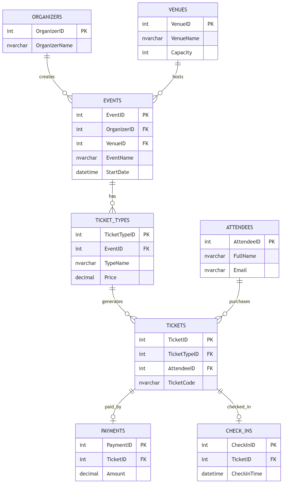
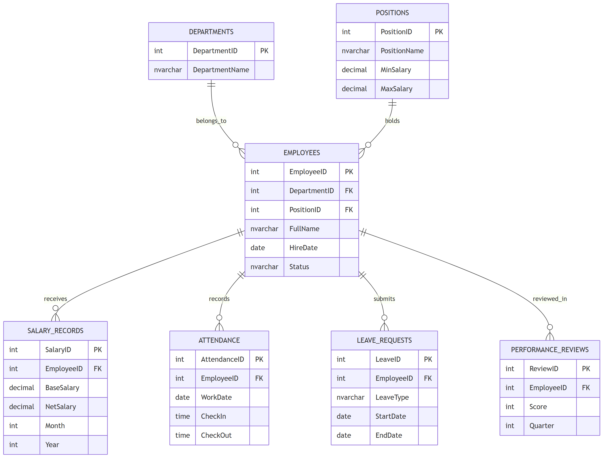

# System Architecture - Project I: Thiet ke Co so du lieu va Bao cao

## Tong quan kien truc he thong

---

## ERD - Chu de A: Ban hang Online

---

## ERD - Chu de B: Book phong Khach san

---

## ERD - Chu de C: Dat ve Su kien

---

## ERD - Chu de D: Quan ly Nhan su

---

## Huong dan ve System Architecture

### Yeu cau bat buoc:
1. The hien ro **4 layers**: Data Sources, Database, Business Logic, Reporting
2. Ghi ro **technology** o moi component (SQL Server, SSRS, ...)
3. Mo ta **data flow** bang mui ten
4. The hien **constraints** va **relationships**
5. Export thanh **PNG** dat trong thu muc `docs/`

### Goi y them:
- Su dung draw.io (mien phi): https://app.diagrams.net
- Excalidraw (sketch style): https://excalidraw.com
- Lucidchart: Chuyen nghiep
