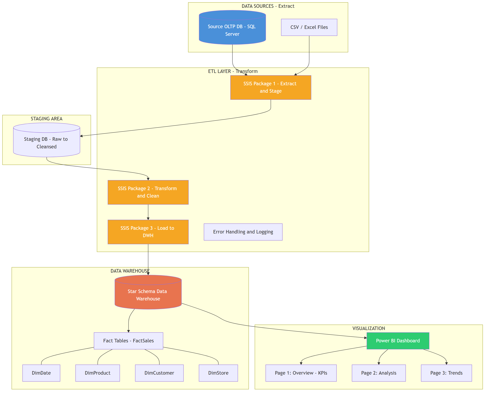
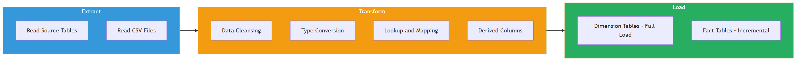
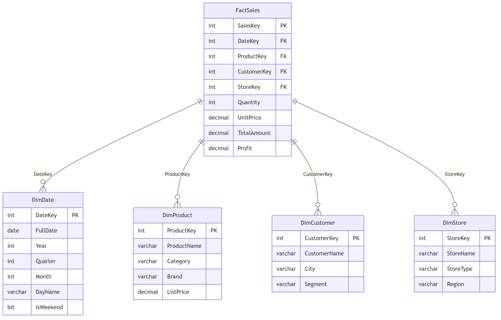

# System Architecture - Project II: Data Warehouse + ETL + PowerBI

## Tong quan kien truc

---

## ETL Data Flow

---

## Star Schema Diagram

---

## Huong dan ve System Architecture

### Yeu cau bat buoc:
1. The hien **4 layers**: Source, ETL, DWH, BI
2. Ghi ro **technology** o moi component (SQL Server, SSIS, Power BI)
3. Mo ta **data flow** bang mui ten
4. Phan biet **full load** vs **incremental load**
5. The hien **error handling** flow

### Goi y them:
- Danh so thu tu steps trong ETL
- Ghi chu schedule (daily, hourly)
- Them monitoring/alerting neu co
