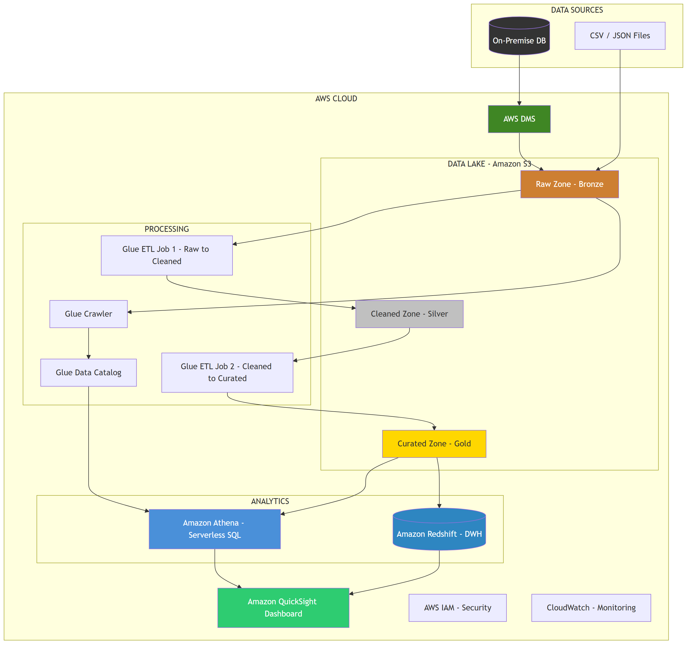

# System Architecture - Project III: AWS DWH & Data Lake

## Tong quan kien truc AWS

---

## Huong dan ve System Architecture

### Yeu cau bat buoc:
1. The hien **tat ca AWS services** su dung
2. Mo ta **3 zones** trong Data Lake (Raw/Cleaned/Curated)
3. Luong du lieu tu **on-premise -> AWS -> Dashboard**
4. The hien **security** (IAM roles)
5. The hien **monitoring** (CloudWatch)

### Goi y them:
- Su dung **AWS Architecture Icons** cho chuyen nghiep
- Ghi chu **data format** o moi layer (CSV -> Parquet)
- Ghi chu **partition strategy**
